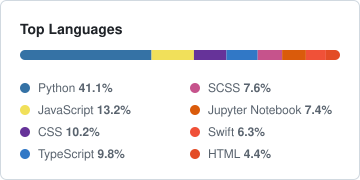

<picture>
  <source media="(prefers-color-scheme: dark)" srcset="./assets/banner-dark.svg">
  <source media="(prefers-color-scheme: light)" srcset="./assets/banner-light.svg">
  
</picture>

## About

Founding engineer at **[CellaNova Technologies](https://www.cellanovatech.com)**, taking agentic and voice AI from zero to production. I spend most of my time on the part nobody demos: latency budgets, grounding claims in source text, and making an agent admit when it does not know.

M.S. Computer Science at Arizona State University (3.93). B.Tech CSE at Andhra University. Formerly AI research on DARPA ASIST at ASU. Ask me about voice agents, LangGraph orchestration, or evidence-grounded RAG.

**Open to engineering roles for 2026.**

## Links

  

## Production Systems

Built at CellaNova. Private codebases, live products.

| System | What it does | Stack |
| :--- | :--- | :--- |
| **NovaSpeak** | Full-duplex voice agent for neurodivergent children. Sub-500ms end to end, with VAD endpointing, barge-in detection, and interruption cancellation. 5x automated engagement. | Twilio, WebSockets, streaming STT/TTS, AWS |
| **[NovaRFP](https://cellanovatech-rfp.com/)** | Agentic GovCon intelligence. Ingests SAM.gov solicitations, extracts obligations, and crosswalks every response claim back to its source text, so nothing gets asserted that the document does not support. 1,700+ solicitations processed at 96.2% claim traceability. | LangGraph, Bedrock, RAG, PostgreSQL |
| **[NovaQuote](https://cellanovatech-pricing.com/)** | AI-native quoting. Agents pull the inputs, validate them, and produce a defensible quote. | Agents, retrieval, automation |
| **[NovaRecruit](https://cellanovatech-dvm.com/)** | Recruiting infrastructure. Gmail thread ingestion, contact enrichment, and geo-weighted candidate ranking. | Python, APIs, AWS |

## Open Source & Side Projects

| Project | What it does | Stack |
| :--- | :--- | :--- |
| **[Multi-Agent-Text-SQL](https://github.com/asaripa3/Multi-Agent-Text-SQL)** | Agents decompose a plain-English question against a schema and emit SQL that actually executes, not SQL that merely parses. | Python, Microsoft AutoGen |
| **[Novah](https://github.com/asaripa3/Novah)** | The EQ agent that became NovaSpeak. Built for neurodivergent users, designed around clarity instead of vibes. | LLM agents, web |
| **[Expense+](https://expense-plus-app.lovable.app/)** · **[iOS](https://github.com/asaripa3/SplitWall)** | Point it at a receipt and it splits the bill fairly, line by line. Shipped as a web app and a native iOS app. | TypeScript, Swift |
| **[Object Detection with Pointing Gestures](https://github.com/asaripa3/Object-Detection-with-Pointing-Gestures)** | Fuses human pointing gestures with a detector so the system knows *which* object you meant. | Python, OpenCV |
| **[AutomatedWarehousing](https://github.com/asaripa3/AutomatedWarehousing)** | Routes warehouse robots to shelves and picking stations, solved declaratively rather than imperatively. | Answer Set Programming |
| **[Matrix Simulations](https://www.meta.com/en-gb/experiences/matrix-simulations/7511045482334190/)** | A published Meta Quest experience. Choose a pill, walk into Morpheus' room. | Unity, VR |

## Tech Stack

**AI & Agents**
        

**Voice & Realtime**
   

**Languages**
    

**Backend & Data**
     

**Frontend**
   

**Infra**
    

## GitHub Stats

<picture>
  <source media="(prefers-color-scheme: dark)" srcset="https://streak-stats.demolab.com?user=asaripa3&hide_border=false&border=3D444D&background=00000000&stroke=3D444D&ring=9198A1&fire=9198A1&currStreakLabel=9198A1&sideLabels=9198A1&currStreakNum=E6EDF3&sideNums=E6EDF3&dates=9198A1&excludeDaysLabel=9198A1">
  
</picture>
<picture>
  <source media="(prefers-color-scheme: dark)" srcset="./assets/langs-dark.svg">
  
</picture>

## Elsewhere

Google Developer Student Club [Lead, 2021-22](https://developers.google.com/profile/badges/community/dsc/2021/lead?u=AdarshSaripalli15). Guest on [Affirmations for Engineers](https://open.spotify.com/episode/1rzgPN0mlRyEuhKRUTkfkj). Shipped [Matrix Simulations](https://www.meta.com/en-gb/experiences/matrix-simulations/7511045482334190/) to the Meta Quest Store.
